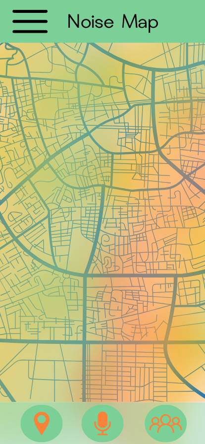
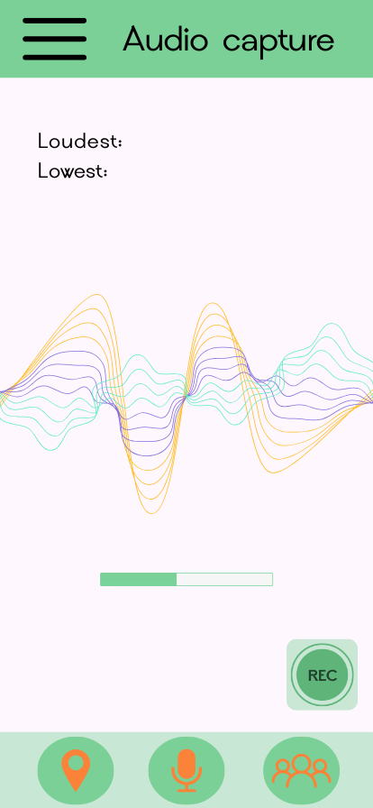
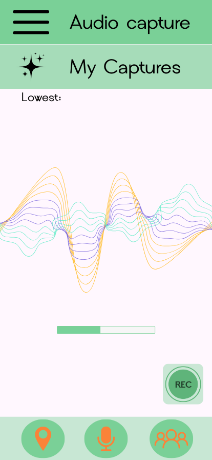

# Overview

the app contains two main functionalites:

- Heatpoints on w map,  marked in colour to represent the noise levels
- Audio recording, through the in-built smartphone microphones.

# Mockup

The current layout and design of the app is in-progress, however the general foundation has been presented in the photos below.

